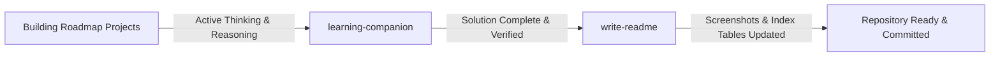

# Workspace Skills

This directory contains custom skills configured for this repository via [`opencode.json`](../../opencode.json).

Each skill extends the AI's capabilities or enforces specific coding methodologies across projects.

---

## Available Skills

| Skill | Directory | Purpose | Trigger / Activation |
| :--- | :--- | :--- | :--- |
| **[learning-companion](learning-companion/)** | [`learning-companion/`](learning-companion/) | Socratic coding coach that guides through questions, predictions, and debugging strategies without writing solutions for you. | Automatically triggers during learning tasks, concept questions, and bug debugging, or via `"guide me"` / `"learning mode"`. |
| **[write-readme](write-readme/)** | [`write-readme/`](write-readme/) | Automates generating standardized project READMEs, capturing desktop screenshots, and updating catalog tables. | Explicitly triggered: `"Write readme for project #X <slug>, I learned..."` |

---

## How Skills Are Configured

Skills are discovered by OpenCode through the root configuration file [`opencode.json`](../../opencode.json):

```json
{
  "$schema": "https://opencode.ai/config.json",
  "skills": {
    "paths": [".opencode/skills"]
  }
}
```

Each skill folder contains:
- **`SKILL.md`**: Contains YAML frontmatter (`name`, `description`) and the execution instructions/guardrails for the AI.
- **`README.md`**: Human-readable documentation, rationale, and usage examples.

---

## Workflow Relationship



