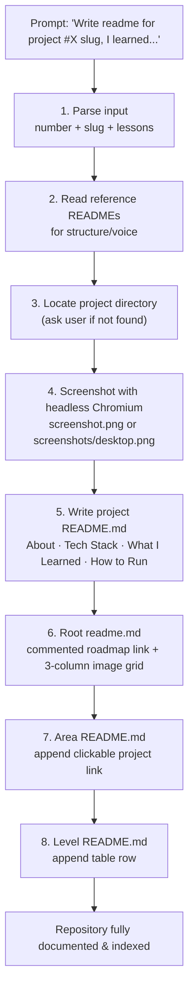
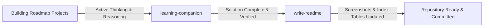

# Write README

An automated documentation skill that generates standardized project READMEs, captures desktop screenshots, and keeps every repository catalog table in sync.

> **"Finished code without documentation is a project nobody can find."**
> The skill turns a one-line prompt into a screenshot, a README, and updated indexes.

---

## Why This Skill Exists

This repository collects projects from [roadmap.sh](https://roadmap.sh/), and each one needs the same documentation: a description, a screenshot, a tech stack, a "what I learned" section, run instructions, and an author line — plus links from the root catalog, the area catalog, and the level table.

Doing that by hand for every project means:

- Screenshots taken at different sizes, or forgotten entirely until the UI changes.
- README structures that drift from project to project.
- Catalog tables and image grids that fall out of date the moment a new folder is created.
- Roadmap.sh links, project numbers, and GitHub URLs retyped (and mistyped) over and over.

The **write-readme** skill centralizes all of that into one repeatable pipeline.

---

## Trigger / Activation

Explicit prompt, triggered manually when a project is complete:

```text
Write readme for project #15 flash-cards, I learned about useState and how to pass useState as a parameter to a component
```

The skill parses three things from that sentence:

| Input Fragment | Parsed As | Example |
| :--- | :--- | :--- |
| `#15` | Project number | `15` |
| `flash-cards` | Project slug (also used to find the folder) | `flash-cards` |
| text after `I learned` | The "What I Learned" section body | `useState ...` |

---

## Pipeline



---

## Step-by-Step Breakdown

1. **Parse the input** — extract the project number, slug, and the lessons learned.
2. **Read reference READMEs** — `01-Single-Pagecv/README.md`, `02-n-03-portfolio/readme.md`, `04-changelog-component/readme.md` for structure and voice.
3. **Find the project directory** — match the number/slug; if ambiguous, ask which folder to use.
4. **Capture a screenshot** — headless Chromium at 1280×800:
   ```bash
   chromium --headless --disable-gpu --screenshot=<project-dir>/screenshot.png \
     --window-size=1280,800 file:///<project-dir>/index.html
   ```
   Saved to `screenshots/` when that subfolder exists, otherwise the project root. If Chromium is unavailable, the step is skipped and noted in the README.
5. **Write the project `README.md`** — title, screenshot section, About, Tech Stack (verified against what the project actually uses), What I Learned, How to Run, Author.
6. **Update root `readme.md`** — insert the commented roadmap.sh link and add a thumbnail to the 3-column image grid in the correct area/level section.
7. **Update the area `README.md`** (e.g. `frontend/README.md`) — append `- [Project Name](beginner/folder/)`.
8. **Update the level `README.md`** (e.g. `frontend/beginner/README.md`) — append `| # | [Project Name](folder/) | Description |`.

---

## Conventions & Rules

| Convention | Value |
| :--- | :--- |
| Author line | `Abukiya - 2026` |
| Roadmap reference | Always include the beginner project number and a roadmap.sh link |
| Root catalog links | Commented: `<!--[Project Name](https://roadmap.sh/projects/<slug>)-->` |
| Screenshot auto-detect order | `screenshots/desktop.png` → `screenshots/homepage.png` → `screenshot.png` |
| Screenshot filename | `screenshot.png`, or `screenshots/desktop.png` when the folder exists |
| Image grid | 3-column markdown table, thumbnail links to the GitHub project directory |
| GitHub repo base URL | `https://github.com/Abukiya/roadmap.sh_projects` |
| Tech stack section | Adjusted per project — checked against `index.html` / `package.json`, never assumed |

---

## Operational Notes

- **Static HTML projects** — screenshot directly from `file:///.../index.html`, no server needed.
- **Vite / React projects** — `file://` cannot resolve bundled modules, so start the dev server first and screenshot the local URL:
  ```bash
  npm run dev
  chromium --headless --disable-gpu --screenshot=screenshots/desktop.png \
    --window-size=1280,800 http://localhost:5173/
  ```
  Remember to stop the dev server afterwards.
- **Unknown tech stack** — inspect the project files rather than copying the stack from a previous README.
- **Missing folder** — never guess; ask the user which directory to document.

---

## Integration with Learning Companion

The skill is the second half of the repository's documentation workflow:

1. **Active Development:** You solve the roadmap.sh challenge using the **[Learning Companion](../learning-companion/)** to reason, debug, and implement your own code.
2. **Project Completion:** Once your solution works, you trigger this skill (`Write readme for project #X <slug>, I learned...`) to automate the screenshot, the local README, and all catalog tables.



---

## Related Files

- [SKILL.md](SKILL.md) — The execution instructions and guardrails run by the AI.
- [Learning Companion README](../learning-companion/README.md) — The Socratic mentor paired with this skill.
- [Skills Catalog](../README.md) — Index of all workspace skills.
