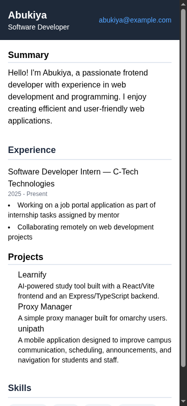

# Single Page CV

A solution for **Beginner Project #1 (Single Page CV)** from [roadmap.sh](https://roadmap.sh/projects/single-page-cv).

## Screenshots

### Desktop

### Mobile

## About

A single-page CV built with HTML and Tailwind CSS. It presents personal details, a summary, experience, projects, education, and skills in a simple responsive layout.

## Technologies

- HTML
- Tailwind CSS via the browser CDN

## Run Locally

Open `index.html` in a web browser.

## What i learned

- I learned that I need to build more stuff that's worth mentioning on my CV
- About essential meta tags for better SEO
- Open Graph (OG) Tags: OG tags for better social media sharing.