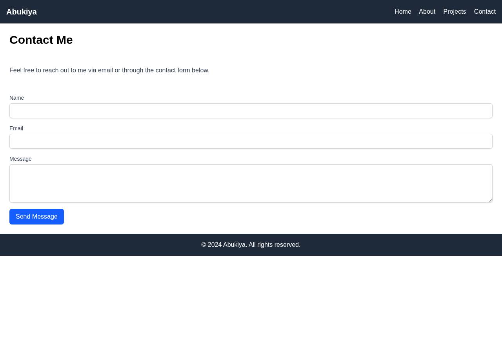
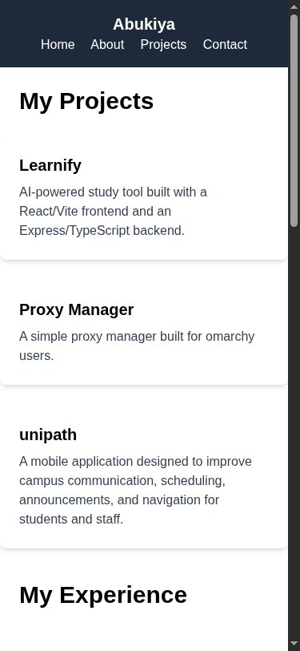
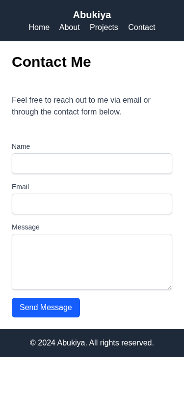

# Personal Portfolio

A responsive multi-page personal portfolio website, built as a solution for **Beginner Project #2 (Basic HTML Website)** and **#3 (Personal Portfolio)** from [roadmap.sh](https://roadmap.sh/projects/portfolio-website).

## Screenshots

### Desktop




### Mobile




## Tech Stack

- **HTML5** - Semantic markup
- **Tailwind CSS v4** - Utility-first styling via CDN

## What I Learned

The main takeaway from this project was **responsive design**. Building a site that looks good on both mobile and desktop required understanding:

- **Tailwind breakpoints** (`sm:`, `md:`) for adapting layouts across screen sizes
- **Flexbox direction switching** - stacking elements vertically on mobile and horizontally on desktop using `flex-col` to `md:flex-row`
- **Viewport meta tag** - ensuring proper scaling on mobile devices
- **Flexible containers** - using `w-full` and responsive padding to prevent overflow on small screens

## How to Run

No build tools needed. Just open any `.html` file directly in a browser.

```bash
# Using a local server (optional)
npx serve .
```

## Author

Abukiya - 2026
