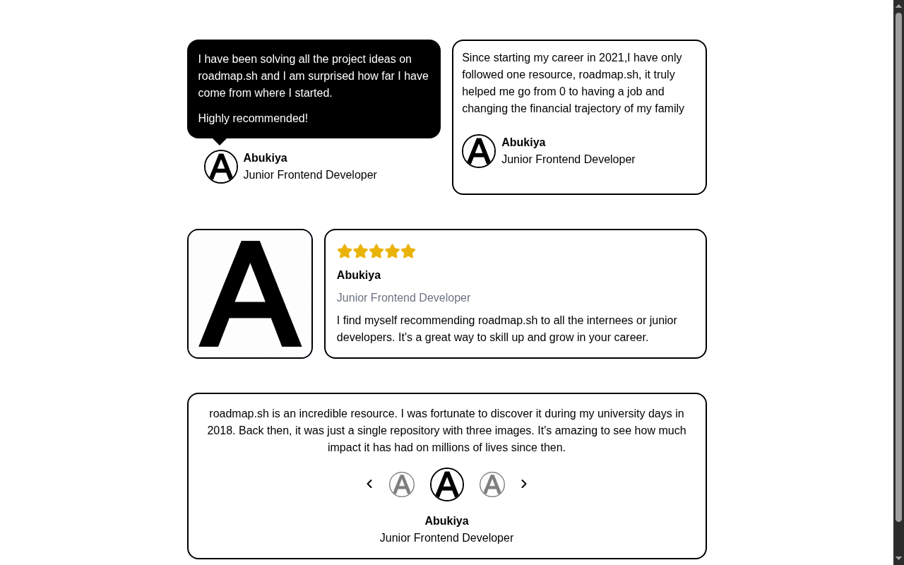

# Testimonial Cards

A responsive testimonial cards layout built with HTML and Tailwind CSS. A solution for **Beginner Project #5 (Testimonial Cards)** from [roadmap.sh](https://roadmap.sh/projects/testimonial-cards).

## Screenshots

### Desktop



## Tech Stack

- **HTML5** - Semantic markup
- **Tailwind CSS v4** - Utility-first styling via CDN
- **Font Awesome** - Icons for stars and navigation arrows

## What I Learned

CSS Position - mostly **relative** and **absolute** positioning:

- **`position: relative`** - Used on parent containers to establish a positioning context for child elements
- **`position: absolute`** - Used to position the speech bubble triangle (CSS border trick) precisely on top of the testimonial card
- **`top`, `left` offsets** - Combined with absolute positioning to fine-tune element placement
- **Parent-child positioning relationship** - Understanding how a relatively positioned parent contains absolutely positioned children

The speech bubble triangle was created using CSS borders (`border-l`, `border-r`, `border-t`) with transparent sides, positioned absolutely within a relatively positioned card.

I got help from AI (OpenCode) to understand how to apply relative and absolute positioning to create the speech bubble effect.

## How to Run

No build tools needed. Just open `index.html` directly in a browser.

```bash
# Using a local server (optional)
npx serve .
```

## Author

Abukiya - 2026
