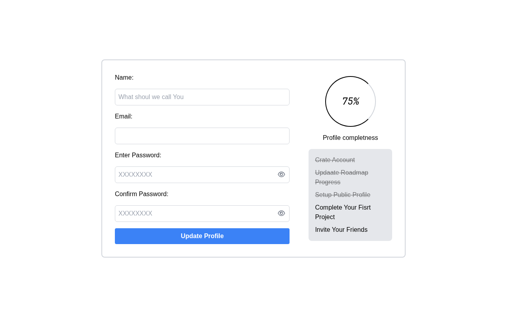

# Accessible Form UI

A static accessible form UI component built with HTML and Tailwind CSS. A solution for **Beginner Project #7 (Accessible Form UI)** from [roadmap.sh](https://roadmap.sh/projects/accessible-form-ui).

## Screenshots

### Desktop



## About

A profile update form featuring Name, Email, Password, and Confirm Password fields with proper labels and input types. Includes a profile completion progress indicator with a checklist. Built with accessibility in mind, using semantic HTML, linked labels, and ARIA attributes.

## Technologies

- HTML5
- Tailwind CSS via the browser CDN
- Font Awesome 6.5.1 for icons

## What I Learned

- How to use `<label for="...">` with matching input `id` attributes so screen readers correctly associate labels with form fields.
- The importance of semantic input types (`type="email"`, `type="password"`) for built-in browser validation and appropriate mobile keyboards.
- Using `aria-label` on form elements to provide accessible names for assistive technologies.
- Proper form structure with `<form>`, `<label>`, `<input>`, and `<button>` elements for screen reader navigation.

I got help from AI (OpenCode) to understand how to structure forms for accessibility using semantic HTML and ARIA attributes.

## Run Locally

No build tools needed. Just open `index.html` directly in a browser.

```bash
# Using a local server (optional)
npx serve .
```

## Author

Abukiya - 2026
