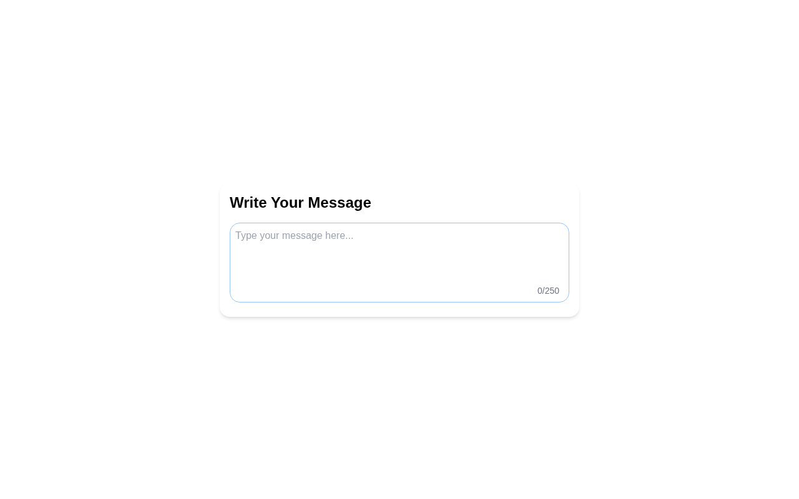

# Restricted Textarea

A character-restricted textarea with live character count and visual feedback when the limit is reached. A solution for **Beginner Project #12 (Restricted Textarea)** from [roadmap.sh](https://roadmap.sh/projects/restricted-textarea).

## Screenshots

### Desktop



## Tech Stack

- **HTML5** - Semantic markup
- **Tailwind CSS v4** - Utility-first styling via CDN
- **JavaScript** - Input event handling and dynamic class toggling

## What I Learned

- The `input` event fires whenever the value of an input/textarea changes (keystrokes, paste, cut), making it ideal for real-time validation
- How to add or remove a CSS class dynamically based on a condition using `classList.add()` and `classList.remove()`
- Using `maxlength` on the textarea to enforce a hard character limit at the HTML level
- Displaying a live character count that updates on every input event

## How to Run

No build tools needed. Just open `index.html` directly in a browser.

```bash
# Using a local server (optional)
npx serve .
```

## Author

Abukiya - 2026
