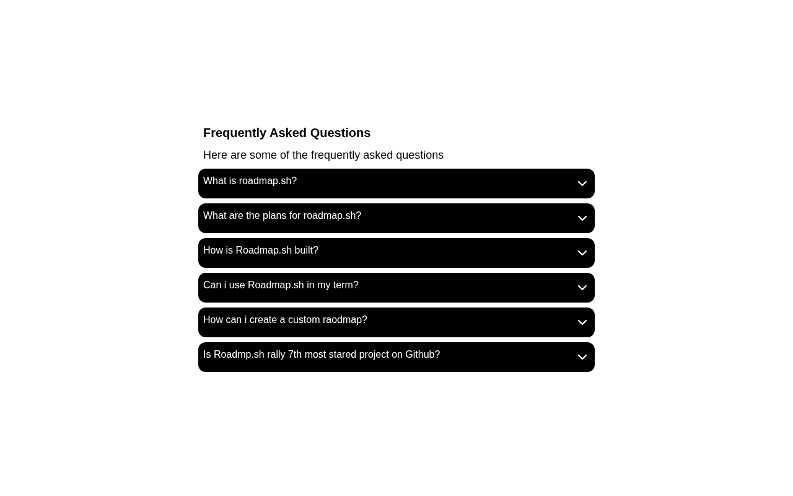

# Accordion

A FAQ accordion component built with HTML, Tailwind CSS, and JavaScript. A solution for **Beginner Project #13 (Accordion)** from [roadmap.sh](https://roadmap.sh/projects/accordion).

## Screenshots

### Desktop



## About

An interactive accordion component that displays frequently asked questions. Clicking a question expands to reveal its answer, with smooth icon transitions between chevron-down and chevron-up states.

## Tech Stack

- **HTML5** - Semantic markup
- **Tailwind CSS** - Utility-first styling via CDN
- **JavaScript** - DOM manipulation for toggle functionality

## What I Learned

- **`querySelectorAll` vs `getElementById`**: `querySelectorAll` selects multiple elements using a class selector (e.g., `.accordion-btn`), while `getElementById` only selects a single element by its unique ID. This makes `querySelectorAll` ideal for handling groups of similar elements like accordion buttons.

## How to Run

No build tools needed. Just open `index.html` directly in a browser.

```bash
# Using a local server (optional)
npx serve .
```

## Author

Abukiya - 2026
