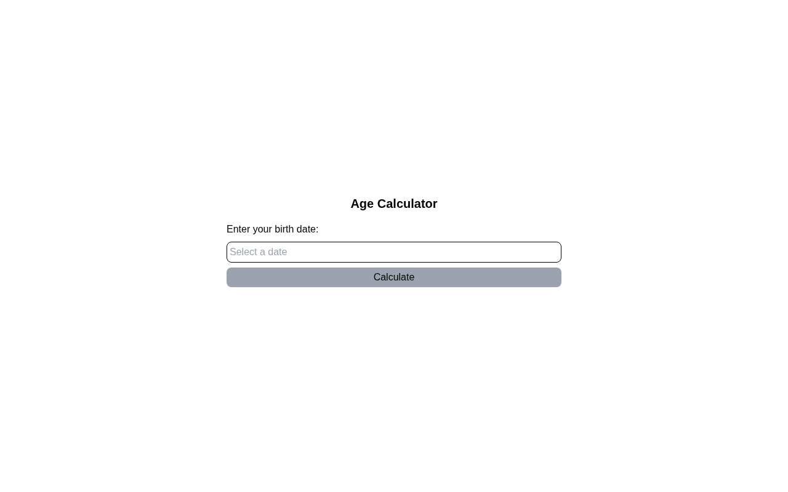

# Age Calculator

A birth date age calculator built with HTML, Tailwind CSS, and JavaScript. A solution for **Beginner Project #14 (Age Calculator)** from [roadmap.sh](https://roadmap.sh/projects/age-calculator).

## Screenshots

### Desktop



## About

Pick a birth date from the calendar and the app calculates how old you are in years, months, and days. The datepicker blocks future dates, and the form checks that a date was actually selected before calculating.

## Tech Stack

- **HTML5** - Semantic markup
- **Tailwind CSS** - Utility-first styling via CDN
- **JavaScript (ES modules)** - Form handling and display logic
- **Vite** - Dev server and build tool
- **npm** - Package manager for project dependencies
- **js-datepicker** - Calendar date selection UI
- **date-fns** - Date math and duration formatting

## What I Learned

- **npm in detail** - How the Node Package Manager works: `package.json` as the project manifest, `dependencies` vs `devDependencies`, `package-lock.json` for locked versions, and the difference between `npm install`, `npm run <script>`, and how `node_modules` stores the actual packages.
- **js-datepicker** - Attaching a calendar picker to a text input with `datepicker("#input_date", options)`, reading the chosen date from `picker.dateSelected`, and using the `maxDate` option to prevent selecting dates in the future.
- **date-fns** - Computing an age with `intervalToDuration({ start, end })` and turning that duration object into readable text with `formatDuration(..., { format: [...] })`. Also learned that `formatDuration` expects the duration object itself as the first argument, and that `intervalToDuration` returns `years`/`months`/`days` (not `weeks`).
- **Form validation** - Listening on the form's `submit` event instead of the button's `click` event, why `e.preventDefault()` belongs there, and that a `readonly` input is excluded from constraint validation so `required` has no effect on it — which meant validating `picker.dateSelected` manually and showing an error message when no date was picked.

## How to Run

```bash
npm install
npm run dev
```

Then open the local URL Vite prints (default `http://localhost:5173`).

```bash
# Production build
npm run build

# Preview the production build
npm run preview
```

## Author

Abukiya - 2026
