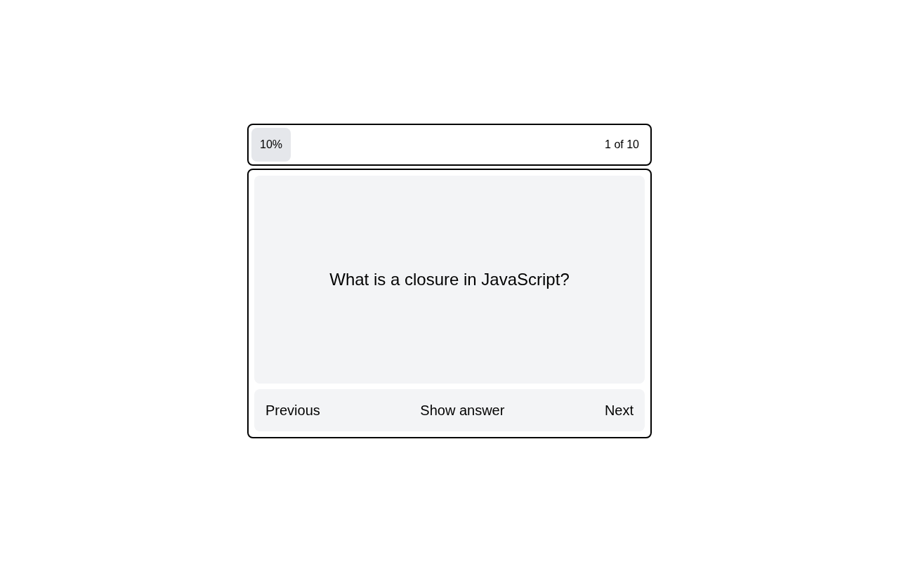

# Flash Cards

A React flashcard app for practicing JavaScript interview questions: flip through cards, reveal the answer, and track progress with a percentage bar. A solution for **Beginner Project #15 (Flash Cards)** from [roadmap.sh](https://roadmap.sh/projects/flash-cards).

## Screenshots

### Desktop



## About

Ten flashcards stored in a config file, each with a question and an answer. The app shows one card at a time with a progress bar (`1 of 10`, `10%` ... `100%`), a **Show answer / Hide answer** toggle, and **Previous** / **Next** buttons to move through the deck. The buttons clamp at both ends, so you can't go past card 1 or card 10.

## Tech Stack

- **React 19** - Component-based UI, `useState` for state
- **Vite** - Dev server and build tool
- **Tailwind CSS v4** - Utility-first styling via the `@tailwindcss/vite` plugin
- **ESLint** - Linting with the React Hooks and React Refresh rules
- **npm** - Package manager for project dependencies

## What I Learned

- **`useState`** - Declaring state in a component with `const [value, setValue] = useState(initial)` and understanding that calling the setter re-renders the component with the new value. In `App` I keep two pieces of state: `answer` (is the answer showing?) and `id` (which card is active).
- **Passing `useState` as a parameter (props) to a component** - The setters themselves can be handed to child components: `<Buttons answer={answer} setanswer={setanswer} id={id} setid={setid} />`. The child never owns the state - it just calls the setter it received, and the parent re-renders with the updated value. This is the "lifting state up" pattern: state lives in the closest common ancestor, and children get both the value and the way to change it.
- **Controlled toggles from a child** - The button label flips between `Show answer` and `Hide answer` because `Buttons` reads the `answer` prop and calls `setanswer(!answer)` on click, so the UI always reflects the current state instead of keeping its own copy.
- **Deriving UI from state instead of duplicating it** - The active card comes from `flashcards.filter((person) => person.id === id)`, and the progress bar width comes from a `widthMap[id]` lookup, so there is no second variable to keep in sync.
- **Conditional rendering with props** - `Card` receives `answer` and switches between `hidden` and `flex` classes to show either the question or the answer, rather than mounting/unmounting elements.

## How to Run

```bash
npm install
npm run dev
```

Then open the local URL Vite prints (default `http://localhost:5173`).

```bash
# Production build
npm run build

# Preview the production build
npm run preview

# Lint
npm run lint
```

## Author

Abukiya - 2026
