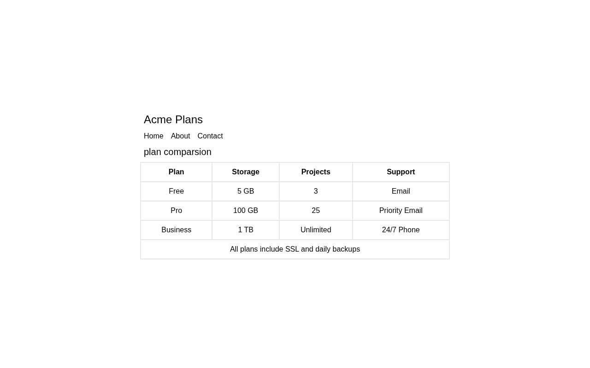

# Pricing Comparison Table

A pricing comparison table for the Acme Plans product: four columns (Plan, Storage, Projects, Support) across Free, Pro, and Business tiers, plus a footnote row spanning the whole table. A solution for **Beginner Project #16 (Pricing Comparison Table)** from [roadmap.sh](https://roadmap.sh/projects/pricing-comparison-table).

## Screenshots

### Desktop



## About

The page shows a heading, a small nav, and a single `<table>` that compares three subscription plans. The header row uses `<th>` cells, each plan is a `<tr>` of `<td>` cells, and the last row uses `colspan="4"` so the note "All plans include SSL and daily backups" stretches across the entire table. A `<caption>` labels the table for screen readers.

## Tech Stack

- **HTML5** - Semantic markup (`table`, `caption`, `th`, `td`, `colspan`)
- **Tailwind CSS v4** - Utility-first styling via the CDN (`border-2`, `p-2`, `text-center`, `w-full`)

## What I Learned

- **Tables in general** - A `<table>` is a grid of rows: `<tr>` for rows, `<th>` for header cells, `<td>` for data cells. Unlike flexbox or grid containers, the table lays itself out in rows and columns from the content, which is exactly what tabular comparison data needs.
- **`<caption>`** - The table's title element. It renders above the table and is announced by screen readers, so the table has a real label instead of a heading that just happens to sit next to it.
- **`colspan`** - The footer row uses `<td colspan="4">` to merge all four columns into one cell, so a full-width note can live inside the table instead of floating outside it.
- **Styling cells directly** - Borders and padding go on the cells (`border-2 p-2`) rather than the table itself, and `text-center` on each `<td>` centers the values while the `<th>` labels stay readable.
- **`w-full` with a max-width wrapper** - The table fills its container, and the outer `md:max-w-2xl` keeps it from stretching across a wide screen.
- **Rows belong in thead/tbody** - Grouping header rows in `<thead>` and body rows in `<tbody>` gives the table structure that browsers and assistive tech can use (e.g. reading headers alongside each cell).

## How to Run

No build tools needed. Just open `index.html` directly in a browser.

```bash
# Using a local server (optional)
npx serve .
```

## Author

Abukiya - 2026
