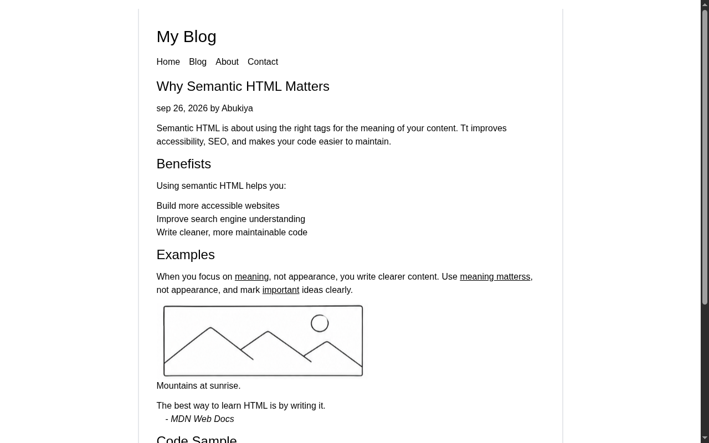

# Blog Post Page

A semantic blog post layout built with HTML and Tailwind CSS. A solution for **Beginner Project #17 (Blog Post Page)** from [roadmap.sh](https://roadmap.sh/projects/blog-post-page).

## Screenshots

### Desktop



## About

A single-column blog post page with a site header, navigation, an article containing headings, lists, a figure, a blockquote, inline and block code, and a footer. The focus is on choosing tags for meaning instead of appearance.

## Tech Stack

- **HTML5** - Semantic markup
- **Tailwind CSS** - Utility-first styling via CDN

## What I Learned

Building this blog post taught me about semantic HTML:

- **Structural elements** - `<header>`, `<nav>`, `<main>`, `<article>`, and `<footer>` describe the role of each section instead of relying on generic `<div>`s
- **Heading hierarchy** - `<h1>` for the post title and `<h2>` for sections makes the document outline clear for screen readers and search engines
- **Text semantics** - `<figure>` with `<figcaption>`, `<blockquote>` with `<cite>`, `<ul>`/`<li>`, and `<span>` for inline emphasis each carry meaning
- **Code elements** - `<code>` for inline code and `<pre><code>` for code blocks preserve formatting and get picked up by accessibility tools
- **Why it matters** - Semantic HTML improves accessibility, SEO, and makes code easier to maintain

## How to Run

No build tools needed. Just open `index.html` directly in a browser.

```bash
# Using a local server (optional)
npx serve .
```

## Author

Abukiya - 2026
