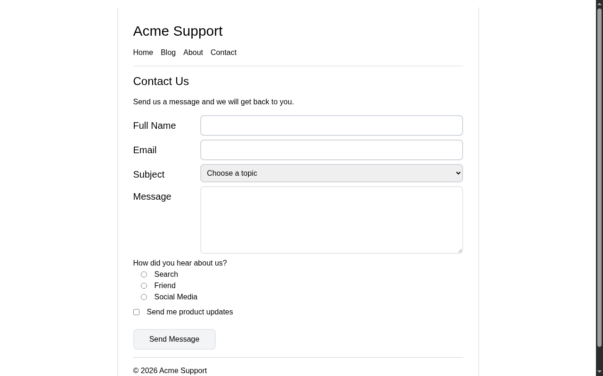

# Contact Form

A contact form built with HTML and Tailwind CSS. A solution for **Beginner Project #18 (Contact Form)** from [roadmap.sh](https://roadmap.sh/projects/contact-form).

## Screenshots

### Desktop



## About

A support contact page with a header, navigation, and a form containing text inputs, an email input, a select, a textarea, radio buttons, a checkbox, and a submit button. The form posts to `https://httpbin.org/post` so submissions can be inspected without a backend.

## Tech Stack

- **HTML5** - Semantic markup
- **Tailwind CSS** - Utility-first styling via CDN

## What I Learned

Building this form taught me what each input attribute actually does:

- **`name`** - The key sent with the value on submit. Without it, nothing gets sent. Radio buttons share the same `name` so only one can be selected.
- **`id` + `for`/`label`** - Ties a label to its control. Clicking the label focuses the input, and screen readers announce the field correctly.
- **`type`** - Sets both behavior and validation: `email` blocks non-email values, `radio` and `checkbox` render the right controls, `submit` turns a button into a form submitter.
- **`required`** - Browser-side validation that stops submission and shows a message when the field is empty.
- **`minlength`** - Enforces a minimum character count (used on the message, set to 20).
- **`value`** - The actual data that gets submitted, and the default state for an option or radio.
- **`method="post"` + `action`** - Where the form data goes; `action` needs a real URL for anything to happen.

A little **DevTools** practice:

- Opening DevTools (F12) and inspecting elements to see the class names and structure the browser actually renders
- The **Elements** panel for checking label/input relationships and live-editing markup
- The **Network** panel for watching the form request fire on submit and seeing the payload that gets sent
- Console messages for spotting anything broken while testing the form

## How to Run

No build tools needed. Just open `index.html` directly in a browser.

```bash
# Using a local server (optional)
npx serve .
```

## Author

Abukiya - 2026
