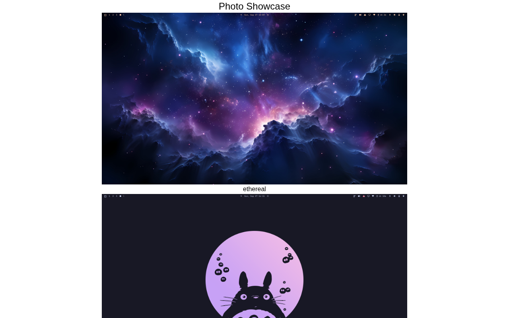

# Photo Showcase

A single-column gallery of themed wallpapers plus an embedded video clip, built with HTML and Tailwind CSS. A solution for **Beginner Project #19 (Photo Showcase)** from [roadmap.sh](https://roadmap.sh/projects/photo-showcase).

## Screenshots

### Desktop



## About

A centered page that stacks a series of `<figure>` blocks - each an image with a matching `<figcaption>` caption - followed by a `<video>` element that plays a local `.webm` file. Everything lives in `assets/`, so the page runs fully offline from `file://`.

## Tech Stack

- **HTML5** - Semantic markup (`figure`, `figcaption`, `video`, `source`)
- **Tailwind CSS** - Utility-first styling via CDN

## What I Learned

**Adding a poster to a video** - the main takeaway:

- The **`poster`** attribute on `<video>` displays an image until playback starts. Without it you get a black rectangle (or the browser's first-frame guess) before the user presses play.
- It takes a normal image path/URL: `poster="assets/tokyo-night.png"` - any format the browser can render as an image works, it does not have to be a video frame.
- It is the video equivalent of an `` `src`: it shows the *cover*, while `src`/`<source>` still holds the actual media.
- The poster disappears as soon as playback begins, and comes back if the video is reset - so it acts as a lightweight thumbnail and improves perceived load time for large files.

Supporting details around the `<video>` element:

- **`<source src="..." type="video/webm">`** - nesting sources inside `<video>` instead of a single `src` lets the browser check formats it can decode and skip the ones it cannot.
- **`controls`** - hands over play/pause, timeline, volume, fullscreen, and speed without writing any JavaScript.
- **`<figure>` + `<figcaption>`** - a caption is semantically tied to its image, which helps screen readers and lets CSS style the pair together.

A little layout practice:

- Centering a fixed-width column (`max-w-3xl`) inside a flex body so images do not stretch edge to edge.
- Keeping the image files in `assets/` and referencing them relatively so the page works with no server.

## How to Run

No build tools needed. Just open `index.html` directly in a browser.

```bash
# Using a local server (optional)
npx serve .
```

> Note: the bundled video is ~231 MB, so the first load can take a moment. The `poster` attribute is what keeps the page from showing an empty box while it loads.

## Author

Abukiya - 2026
