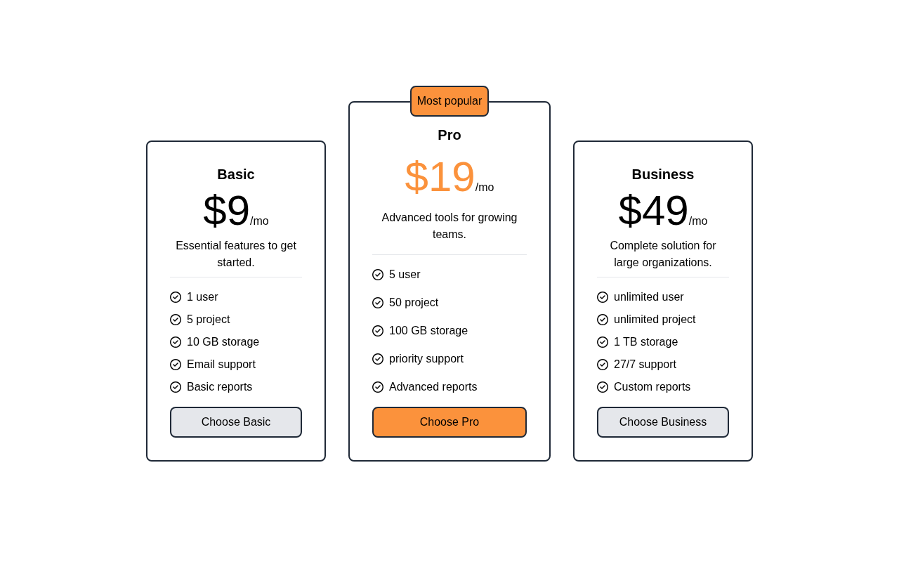

# Pricing Cards

A row of three pricing cards (Basic, Pro, Business) with a highlighted "Most popular" plan, built with HTML and Tailwind CSS. A solution for **Beginner Project #20 (Pricing Cards)** from [roadmap.sh](https://roadmap.sh/projects/pricing-cards).

## Screenshots

### Desktop



## About

A centered page that stacks three plan cards on mobile and lays them out in a row on large screens. Each card holds a plan name, a large price, a tagline, a `<hr>`, a feature list with check icons, and a CTA button. The middle Pro card is wider, uses an orange price, and carries an absolutely positioned "Most popular" badge that hangs over its top border.

## Tech Stack

- **HTML5** - Semantic markup (`h1`, `h2`, `hr`, `button`)
- **Tailwind CSS** - Utility-first styling via the Play CDN
- **Font Awesome** - Check-circle icons for the feature list

## What I Learned

**`min-h-screen`** - makes an element at least as tall as the viewport:

- `body` gets `flex justify-center items-center min-h-screen`, so the card row is centered both vertically and horizontally instead of hugging the top of the page.
- Without `min-h-screen` the body is only as tall as its content, so `items-center` has no extra space to center within - the cards just sit at the top.
- It is a *min* height, not a fixed one: if the content grows past the viewport (small screen, long feature list), the page still scrolls instead of clipping.

**`mt-auto`** - pushes a flex child to the far end of a `flex-col` container:

- Each card is `flex flex-col`, and the button wrapper has `mt-auto`, so it is pushed to the bottom no matter how much content sits above it.
- That is what makes the buttons line up even though the three cards have different amounts of text - the cards themselves stretch to the same height in the row, and `mt-auto` absorbs the leftover space inside each one.
- It only takes up the *remaining* space, so it never adds a gap when the content already fills the card.
- Put `mt-auto` on a wrapper div (not the `<button>`), because the button needs `w-full` to stretch across the card.

Supporting details around the layout:

- **`gap-8` + `flex-col lg:flex-row`** - the row switches to a vertical stack on small screens and to a horizontal row at `lg`, with spacing handled by `gap` instead of margins on the siblings.
- **`relative` on the card + `absolute -top-6` on the badge** - the "Most popular" label is pulled above the card's top edge; `z-50` keeps it over the border.
- **Hover states** - `hover:bg-gray-300` / `hover:bg-orange-500` changes the background rather than relying on color alone.
- **`w-64` vs `w-72`** - the Pro card is slightly wider so the recommended plan reads as the emphasized one.

## How to Run

No build tools needed. Just open `index.html` directly in a browser.

```bash
# Using a local server (optional)
npx serve .
```

## Author

Abukiya - 2026
