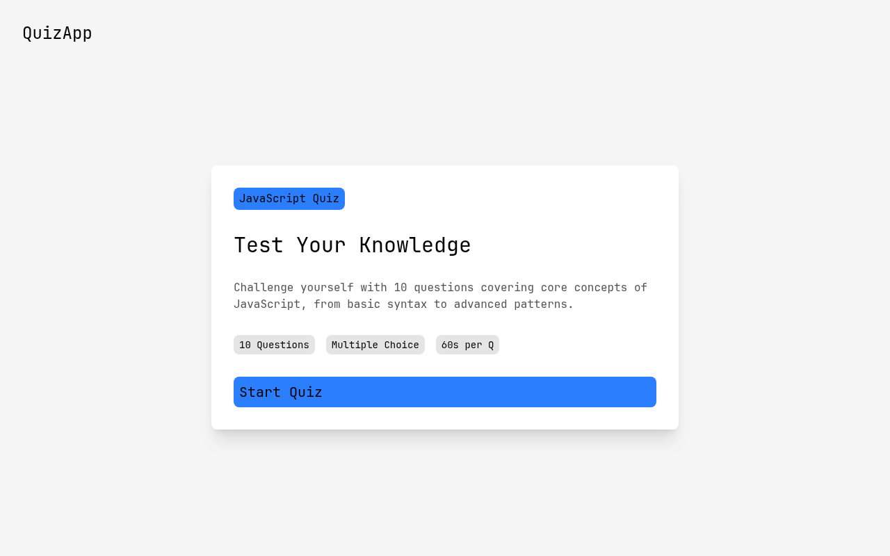
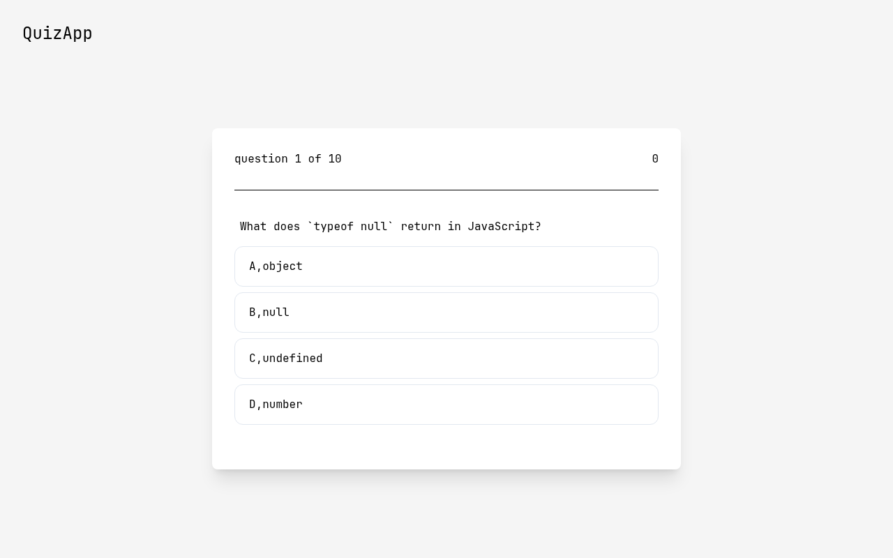

# Quiz App

A JavaScript quiz app built with React Router - start screen, question flow, and a results screen that receives the score through router state. A solution for **Intermediate Project #1 (Quiz App)** from [roadmap.sh](https://roadmap.sh/projects/quiz-app).

## Screenshots

### Desktop



### Questions



## About

The app has three routes wrapped in a shared layout:

- `/` - start screen with the quiz intro and a link to the first question
- `/question` - one question at a time with score tracking, answer feedback, and an explanation toggle
- `/result` - final score, retry, and home buttons

When the last question is answered, the score is passed to the result route with `navigate("/result", { state: ... })`. The result screen reads it back with `useLocation().state` and shows a friendly message when someone opens the route directly without taking the quiz.

Routes are wrapped in an `ErrorBoundary` so a crash in the question or result screen renders an error page with a reset option instead of taking down the whole app.

## Tech Stack

- **React 19** - UI library
- **Vite 8** - build tool and dev server
- **React Router 8** - routing, `useNavigate`, `useLocation`
- **Tailwind CSS v4** - utility-first styling via `@tailwindcss/vite`
- **ESLint** - linting

## What I Learned

- **Error boundaries** - wrote a class component with `getDerivedStateFromError` and `componentDidCatch`, learned that only class components can catch render errors, and built a custom `fallback` prop plus a reset function so the app can recover instead of staying crashed.
- **`useNavigate`** - imperative navigation for the "Next Question", "See Results", "Retry Quiz", and "Go to Home" buttons, including passing data to the next route with `navigate(path, { state })`.
- **`useLocation`** - reading the `state` object sent by `navigate` on the results screen, and handling the case where `state` is `undefined` because the URL was opened directly.
- **State** - `useState` for the current question index, the running score, and the selected answer, plus deriving the next view from state instead of mutating the DOM.

## How to Run

```bash
npm install
npm run dev      # start dev server
npm run build    # production build
npm run preview  # serve the build
```

## Author

Abukiya - 2026
