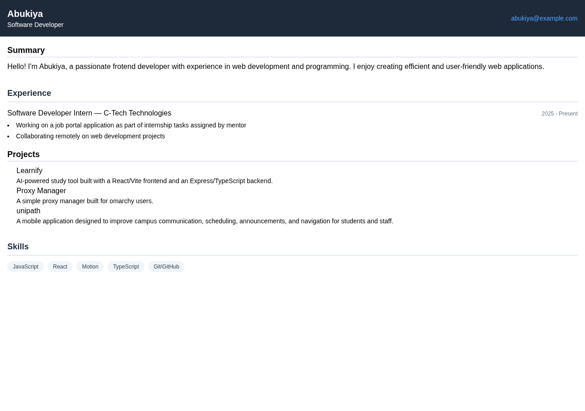
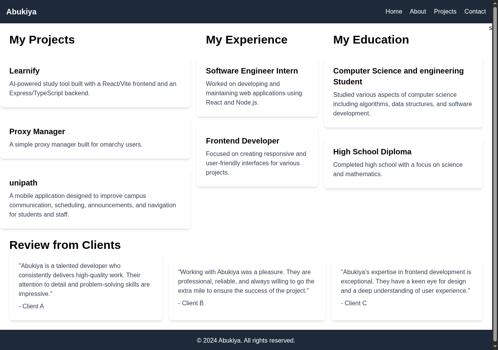
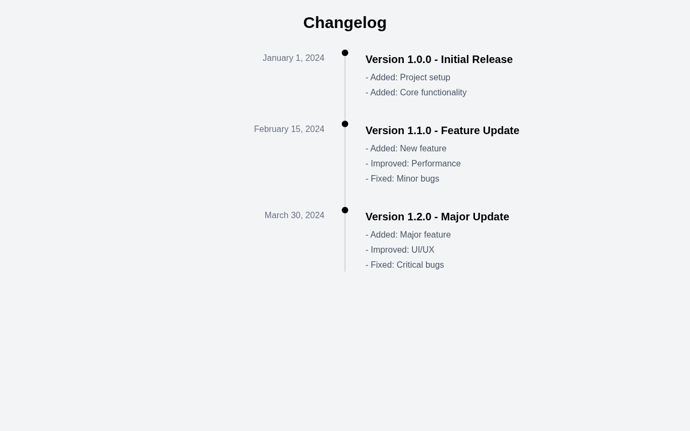
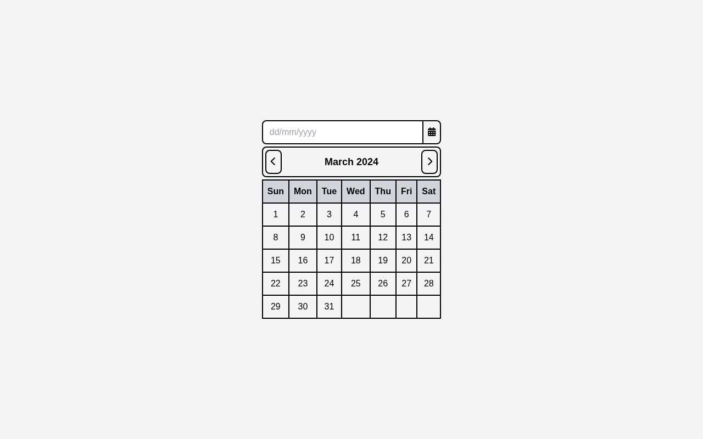
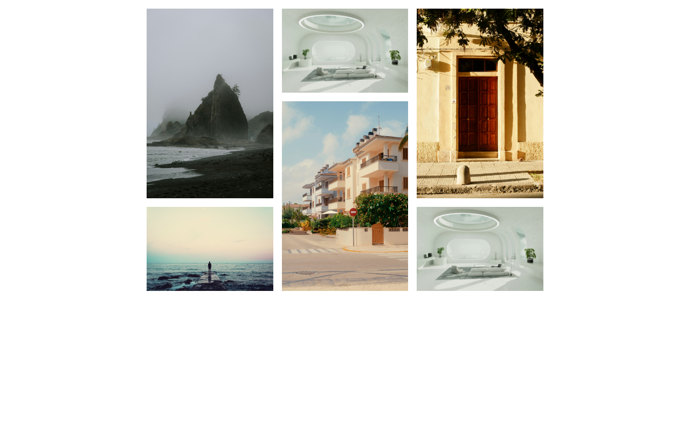
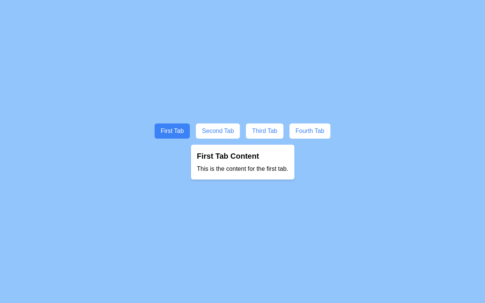

# roadmap.sh Projects

A collection of projects completed from the [roadmap.sh](https://roadmap.sh/) project lists.

The work is organized by development area and difficulty. I am starting with frontend projects, then continuing with backend projects.

## Roadmap

1. Frontend
2. Backend

More development areas can be added as the collection grows.

## Project Levels

Each area is divided into three levels:

- `beginner` - foundational projects and core concepts
- `intermediate` - projects that combine multiple skills and patterns
- `advanced` - larger projects with more complex requirements

## Directory Structure

```text
roadmap_projects/
├── readme.md
├── frontend/
│   ├── beginner/
│   │   └── project-name/
│   │       ├── index.html
│   │       └── README.md
│   ├── intermediate/
│   └── advanced/
└── backend/
    ├── beginner/
    ├── intermediate/
    └── advanced/
```

## Project Documentation

Each project should have its own `README.md` describing:

- the project requirements
- the technologies used
- how to run it
- what I learned
- a link to the live version, when available

## Automation

## AI Skills & Workflow

Project READMEs are auto-generated using an AI skill located at `.opencode/skills/write-readme/`.
This repository uses custom AI skills located in [`.opencode/skills/`](.opencode/skills/) to maintain code quality, promote deep learning, and automate repository documentation:

- **[Learning Companion](.opencode/skills/learning-companion/)**: A Socratic coding mentor that guides through reasoning, prediction, and debugging without writing code for the learner (_"If you're not thinking, you're not learning"_).
- **[Automated Documentation](.opencode/skills/write-readme/)**: Automatically captures screenshots via headless Chromium, standardizes project `README.md` files, and updates catalog tables upon completing a project.

## Current Projects

### Frontend

#### Beginner

<!--[Single Page CV](https://roadmap.sh/projects/single-page-cv)-->
<!--[basic html website](https://roadmap.sh/projects/basic-html-website)-->
<!--[Personal Portfolio](https://roadmap.sh/projects/portfolio-website)-->
<!--[Changelog Component](https://roadmap.sh/projects/changelog-component)-->
<!--[Testimonial Cards](https://roadmap.sh/projects/testimonial-cards)-->
<!--[Datepicker UI](https://roadmap.sh/projects/datepicker-ui)-->
<!--[Accessible Form UI](https://roadmap.sh/projects/accessible-form-ui)-->
<!--[Image Grid](https://roadmap.sh/projects/image-grid)-->
<!--[Tooltip UI](https://roadmap.sh/projects/tooltip-ui)-->
<!--[Simple Tabs](https://roadmap.sh/projects/simple-tabs)-->
<!--[Cookie Consent](https://roadmap.sh/projects/cookie-consent)-->

Click any image to go to the project directory.

|                                                                                                                                                                                                     |                                                                                                                                                                                         |                                                                                                                                                                                                             |
| :-------------------------------------------------------------------------------------------------------------------------------------------------------------------------------------------------: | :-------------------------------------------------------------------------------------------------------------------------------------------------------------------------------------: | :---------------------------------------------------------------------------------------------------------------------------------------------------------------------------------------------------------: |
|   [](https://github.com/Abukiya/roadmap.sh_projects/tree/main/frontend/beginner/01-Single-Pagecv)<br>Single Page CV    | [](https://github.com/Abukiya/roadmap.sh_projects/tree/main/frontend/beginner/02-n-03-portfolio)<br>Portfolio | [](https://github.com/Abukiya/roadmap.sh_projects/tree/main/frontend/beginner/04-changelog-component)<br>Changelog Component |
| [](https://github.com/Abukiya/roadmap.sh_projects/tree/main/frontend/beginner/05-testimonial-cards)<br>Testimonial Cards |   [](https://github.com/Abukiya/roadmap.sh_projects/tree/main/frontend/beginner/06-datepicker-ui)<br>Datepicker UI   |   [](https://github.com/Abukiya/roadmap.sh_projects/tree/main/frontend/beginner/07-accessible-form-ui)<br>Accessible Form UI   |
|               [](https://github.com/Abukiya/roadmap.sh_projects/tree/main/frontend/beginner/08-image-grid)<br>Image Grid               |         [](https://github.com/Abukiya/roadmap.sh_projects/tree/main/frontend/beginner/09-tooltip-ui)<br>Tooltip UI         |                 [](https://github.com/Abukiya/roadmap.sh_projects/tree/main/frontend/beginner/10-simple-tabs)<br>Simple Tabs                 |
|                 [](https://github.com/Abukiya/roadmap.sh_projects/tree/main/frontend/beginner/11-cookie-consent)<br>Cookie Consent                 |                                                                                                                                                                                         |                                                                                                                                                                                                             |
